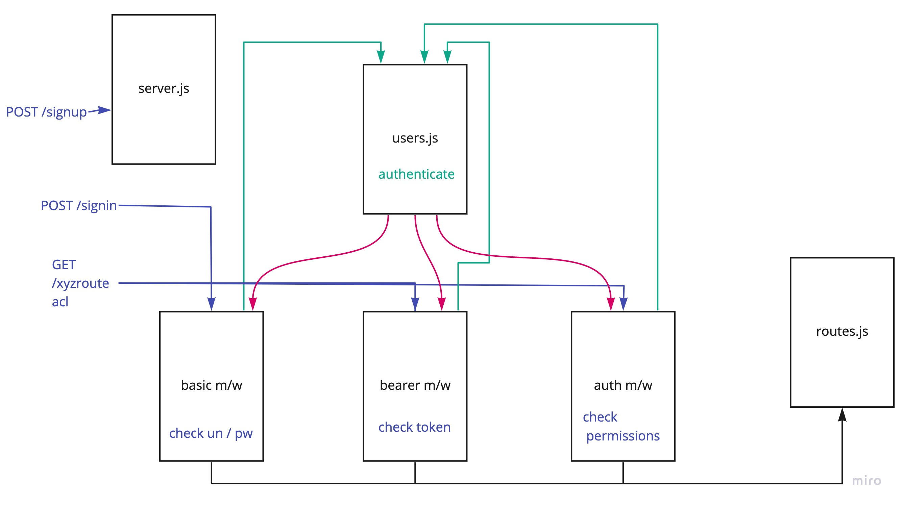

# LAB - Class 08

## Project: Auth-API

### Author: Brendan Smith

### Links and Resources

- [ci/cd](https://github.com/brendigler/auth-api/actions)
- [server url](https://brsmith-auth-api.herokuapp.com/)
- [Pull Request](https://github.com/brendigler/auth-api/pull/1)

### Setup

#### `.env` requirements

- `PORT` - Port Number
- `MONGODB_URI` - MongoDB URI
- `SECRET` - JWT secret

#### How to initialize/run your application

- clone to local repo
- `npm install`
- `npm start`

#### Tests

- Run tests with `npm test`

#### UML / Application Wiring Diagram

